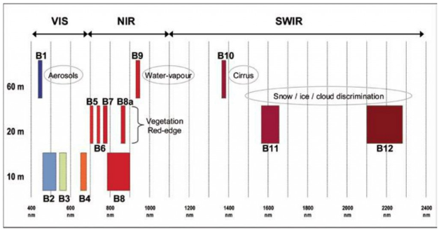

# Prueba técnica: Programación básica con imágenes TIFF

## Requerimientos

### Repositorio del proyecto

Clona este repositorio de git, por ejemplo desde una terminal de Linux o MacOS:

```bash
# Probablemente necesites que quien te asignó la prueba te de permisos explícitos
# para clonar el repositorio

git clone https://github.com/AGRIICOLA/ejercicio_raster /home/artorres/projects/innmortal/ejercicio_raster
```

En este documento se asume que el repositorio está en la ruta local:  `/home/artorres/projects/innmortal/ejercicio_raster/`

En adelante cambia las direcciones según corresponda a tu entorno de trabajo local

### Entorno de ejecución

Para este ejercicio necesitas python (3.11 o mayor) y un gestor de paquetes (pip, anaconda, etc). Es recomendable que generes un entorno virtual para evitar cambios innecesarios en tu sistema operativo.

También necesitas instalar los siguientes paquetes: rasterio, numpy, matplotlib

## Introducción

De la misma manera en que las cámaras fotográficas convencionales capturan la luz visible y la almacenan en formatos de archivo con un modelo de color en tres canales (RGB), donde cada canal se compone de un arreglo de valores númericos (píxeles), los satelites de observación de la tierra tienen sensores ópticos que registran, además de los componentes RGB de la luz visible, otros rangos del espectro electromagnético, que según la sensibilidad de los instrumentos, normalmente van de 4 a 13 rangos (llamados bandas) en instrumentos multiespectrales hasta más de 100 bandas en instrumentos hiperespectrales.

Por ejemplo, los satélites multiespectrales de la constelación Landsat 8 y 9 registran 13 bandas que van de la luz visible al infrarrojo de onda corta:



Siguiendo la analogía, los instrumentos ópticos de estos satélites se pueden considerar como cámaras fotográficas que registran más colores (segmentos del espectro), cada uno de ellos con significado específico.

Los datos de cada banda se disponen en arreglos de valores numéricos (los valores de píxel):


El ejemplo más familiar es una imagen que representa el color “verdadero” de la superficie terrestre, en la cual un píxel dado corresponde a la combinación de tres bandas, que corresponden al modelo de color RGB:


### Tag Image File Format

Uno de los formatos de archivo más comunes para el almacenamiento de imágenes de satélite es el estándar [TIFF](https://en.wikipedia.org/wiki/TIFF).

En Python existen varios paquetes que permiten trabajar con imágenes TIFF: rasterio, gdal, numpy, etc. Por ejemplo, con la [función open](https://rasterio.readthedocs.io/en/stable/topics/reading.html) de rasterio se accede a los metadatos de un archivo TIFF y a los datos subyacentes:

```python
from rasterio import open
from matplotlib import pyplot
from numpy import nan, nanmin, nanmax

image = open('./insumos/1021_20230404_ndvi.tiff')

print(f'File name: {image.name}')
print(f'Open mode: {image.mode}')
print(f'Metadata: {image.meta}')

pixels = image.read(image.meta.get('count'))
pixels[(pixels == -999)] = nan

print(f'Data type: {type(pixels)}')
print(f'Image size: {pixels.shape}')
print(f'Max. value: {nanmax(pixels.flatten())}')
print(f'Min. value: {nanmin(pixels.flatten())}')

pyplot.imshow(pixels, cmap='RdYlGn')
pyplot.show()
```
```bash
File name: ./insumos/1021_20230404_ndvi.tiff
Open mode: r
Metadata: {'driver': 'GTiff', 'dtype': 'float64', 'nodata': -999.0, 'width': 173, 'height': 185, 'count': 1, 'crs': CRS.from_epsg(3857), 'transform': Affine(10.65825353862634, 0.0, -11320094.309662528,
       0.0, -10.65825353862634, 2190147.407727897)}
Data type: <class 'numpy.ndarray'>
Image size: (185, 173)
Max. value: 0.9830508232116699
Min. value: -0.5438596606254578
```


Como se ve en el ejemplo:

- La imagen se abrió en modo lectura
- Tiene solo una banda (clave count en el diccionario con los metadatos de la imagen)
- Tiene 173 píxeles de ancho y 185 de alto
- El tipo de dato de los píxeles es float64
- El valor de píxel -999 corresponde a píxeles sin datos relevantes, por ejemplo, las partes transparentes de una imagen en formato PNG
- La función read() devuelve los píxeles en un ndarray de 2 dimensiones Numpy
- Los valores de píxel máximos y mínimos son 0.9830508232116699 y -0.5438596606254578

A partir de este ejemplo te puedes dar cuenta que el contenido de la imagen y sus metadatos se han abstraído a tipos de datos de python y objetos de numpy, lo cual da una idea del conjunto de posibilidades que existen para manipular los datos de la imagen.

Por supuesto, también es posible hacer el proceso inverso:

1. Generar un arreglo bidimensional cuyos valores tengan un significado específico, e.g. temperatura, elevación, humedad, ausencia/presencia de alguna variable, etc.
2. Guardar los datos en un archivo tiff y visualizar los resultados como una imagen.

## Prueba de programación general

Siguiendo el ejemplo anterior considera estos datos:

```python
from rasterio import open
from matplotlib import pyplot
from numpy import nan

ndvi = open('./insumos/1021_20230404_ndvi.tiff')

pixels = ndvi.read(ndvi.meta.get('count'))

pixels[(pixels == -999)] = nan

pyplot.imshow(pixels, cmap='RdYlGn')

pyplot.show()

```


```python
ndwi = open('./insumos/1021_20230404_ndwi.tiff')

pixels = ndwi.read(ndwi.meta.get('count'))

pixels[(pixels == -999)] = nan

pyplot.imshow(pixels, cmap='Blues')

pyplot.show()
```


El objetivo de esta prueba es que escribas un programa con python que tome como insumo los archivos tiff del ejemplo y genere una imagen como las de pyplot en un archivo PNG, con las siguientes restricciones:

- No utilices pyplot o algo equivalente, la generación del PNG con la paleta de color puede hacerse exclusivamente con numpy, aunque sí puedes utilizar cualquier paquete de Python para escribir el PNG en un archivo local.
- Haz que los valores de -999 se representen como píxeles totalmente transparentes en el PNG resultante
- La imagen **1021_20230330_ndvi.tiff** tiene otro valor con un significado especial, el -998, que corresponde a nubes. El programa que hagas debe dibujar esos píxeles en color blanco.
- El programa debe funcionar para cualquier imagen con datos similares, no solo los que están en el repositorio.
- Ten en cuenta que las imágenes del ejercicio se dibujan con dos paletas de color distintas: 'Blues' para el archivo **1021_20230404_ndwi.tiff** y 'RdYlGn' para el **1021_20230404_ndvi.tiff**

Toma como referencia para el resultado que se espera estas imágenes:
- [Imagen (NDVI) sin nubes](https://gitlab.com/dev-innmortal/ejercicio_raster/-/blob/main/recursos/imagenes/1021_20230404_ndvi.png)
- [Imagen (NDVI) con nubes](https://gitlab.com/dev-innmortal/ejercicio_raster/-/blob/main/recursos/imagenes/1021_20230330_ndvi.png)
- [Imagen (NDWI) sin nubes](https://gitlab.com/dev-innmortal/ejercicio_raster/-/blob/main/recursos/imagenes/1021_20230404_ndwi.png)
- [Imagen (NDWI) con nubes](https://gitlab.com/dev-innmortal/ejercicio_raster/-/blob/main/recursos/imagenes/1021_20230330_ndwi.png)

## Prueba de resolución de problemas

### Firmas espectrales

Un concepto muy utilizado en el análisis de información satelital es el de firmas espectrales. En términos simples se basa en el hecho de que diferentes materiales (depósitos de agua superficial, vegetación con altos niveles de clorofila, vegetación seca, suelo sin vegetación, concreto, etc.) reflejan y absorben la radiación electromagnética en diferentes longitudes de onda.


Entonces, si pudiéramos tomar en una sola fotografía de la superficie terrestre los valores asociados a cada segmento del espectro electromagnético (componentes rojo, verde y azul de la luz visible, infrarrojo, infrarrojo de onda corta, etc.), tal imagen potencialmente nos serviría para identificar materiales no solo por su apariencia visible (rojo, verde y azul), si no por su respuesta espectral en otros segmentos del espectro electromagnético. Esto es lo que se conoce como la “firma espectral” de un material.

Este tipo de análisis tiene aplicaciones muy concretas en el manejo agrícola y forestal, porque permite identificar deficiencias nutricionales (en términos de la cantidad de clorofila en la planta), cantidad de humedad en las hojas, el volumen de masa vegetal, etc.


Más aún, diferentes tipos de especies vegetales tienen variaciones constantes en ciertas partes de la firma espectral común a las especies que sintetizan clorofila, dado que la fisiología de cada especie hace que las cantidades de clorofila no sean siempre las mismas.


### Cálculo de firmas espectrales

El método más simple para obtener firmas espectrales de especies vegetales consiste en:

- Identificar áreas geográficas en las que se sabe que hay una presencia homogénea de una determinada especie. Por ejemplo, parcelas agrícolas sembradas por completo de alfalfa, con una edad, nivel de humedad y contenido de clorofila similares.
- A partir de una imágen de satélite multi o hiper espectral, extraer todos los píxeles que corresponden a cada zona identificada en el inciso 1, en todas las bandas relevantes para el análisis de vegetación.
- Si es necesario, convertir los valores de píxel a [valores de reflectancia](https://docs.sentinel-hub.com/api/latest/data/sentinel-2-l2a/#:~:text=For%20Sentinel%2D2%20optical%20data,%3A%20DN%20%3D%2010000%20*%20REFLECTANCE%20.).
- Obtener las estadísticas descriptivas del conjunto de píxeles de todas las zonas, por cada banda.

Por ejemplo:

```python
from rasterio import open
from numpy import nanstd, nanmean, nanmin, nanmax, nan
import matplotlib.pyplot as plt

# Central wavelength per band
#
# https://docs.sentinel-hub.com/api/latest/data/sentinel-2-l2a/#available-bands-and-data

wavelength = [0.4924, # B02
             0.5598,  # B03
             0.6646,  # B04
             0.7041,  # B05
             0.7405,  # B06
             0.7828,  # B07
             0.8328,  # B08
             0.8647,  # B8A
             1.6104,  # B11
             2.1857   # B12
           ]

sample = open('./insumos/sentinel_2_bands/1147.tif')

band_count = sample.meta['count']
nodata_value = sample.meta['nodata']

reflectance_mean = []
reflectance_max = []
reflectance_min = []
reflectance_std = []

for band_number in range(1, band_count+1):
   band = sample.read(band_number)

   # Convert to reflectance values
   # https://docs.sentinel-hub.com/api/latest/data/sentinel-2-l2a/#units
  
   band = band / 10000

   band = band.flatten()

   # Set nodata pixel values to nan
   band[(band == nodata_value)] = nan

   reflectance_mean.append(nanmean(band))
   reflectance_max.append(nanmax(band))
   reflectance_min.append(nanmin(band))
   reflectance_std.append(nanstd(band))

plt.figure(figsize=(12,6))
plt.plot(wavelength, reflectance_mean, label='Mean')

# Mean, max and min
# plt.fill_between(wavelength,
#                  reflectance_min,
#                  reflectance_max,
#                  color='blue',
#                  alpha=0.1)
# plt.title('Mean +- 1 standard deviation, per band')

# Mean, +- 1 Std. Dev.
plt.fill_between(wavelength,
                [mean + std for std, mean in zip(reflectance_std, reflectance_mean)],
                [mean - std for std, mean in zip(reflectance_std, reflectance_mean)],
                color='blue',
                alpha=0.1)
plt.title('Mean, maximum and minimum per band')

plt.xlabel('Wavelenght (nm)')
plt.ylabel('Reflectance (%)')
plt.xticks(wavelength, [round(i, 3) for i in wavelength], fontsize=9, rotation=90)
plt.grid(linestyle = 'dashed', linewidth = 0.5)
plt.legend()
```


Estos son los parámetros de la firma espectral. Es decir, se espera que para la misma especie, en condiciones similares de edad, humedad, etc., los valores de cada banda se encuentren dentro de los parámetros de la firma espectral, ya sea el máximo y mínimo, o +- 1 desviación estándar.

Naturalmente, los parámetros de la firma espectral se verán afectados por el tamaño de la muestra, la calidad de las observaciones, etc.

Otra consideración importante es que la misma especie puede tener firmas espectrales diferentes, según su edad, salud y humedad.

## Aplicación de firmas espectrales

Las aplicaciones de las firmas espectrales son muy variadas, por ejemplo, alertas tempranas de deforestación, monitoreo agrícola, identificación de sitios de minería ilegal, etc.

La premisa básica como ya mencionamos, es que el mismo material (en nuestro caso, la misma especie vegetal), en condiciones similares, tendrá una respuesta espectral parecida, dentro de un margen de error conocido.

La versión más básica de la aplicación de firmas espectrales para especies vegetales supone los siguientes pasos:

1. Obtener una imágen multiespectral que cubra la zona de estudio, con el mismo número de bandas que la muestra con la que se obtuvo la firma espectral.
1. Probar todos los píxeles de la imagen, y evaluar si su valor cae dentro de los parámetros de la firma espectral, banda por banda. Es decir, probar si el valor de píxel, para cada banda, cae en la zona gris de la ilustración anterior.
1. Si en todas las bandas el valor de píxel cae dentro de los límites de la firma espectral (ya sea el máximo y el mínimo o 1 unidad de desviación estándar) se considera que el píxel representa la misma especie vegetal que la firma espectral.
1. En un arreglo del mismo tamaño que la imagen multiespectral usada como insumo, y con todos sus valores en 0 inicialmente, se asignará un 1 al píxel identificado en el paso anterior. El resultado será una imagen con dos valores: 0 indica ausencia de la especie identificada y 1 presencia.

Tomando como base el código anterior, puedes probar las firmas espectrales en una zona de muestra.

**NOTA**: El método utilizado aquí para generar el arreglo de resultados no es el mismo que el indicado en el paso 4, pero es equivalente.

```python
# Apply spectral signatures to a sample dataset

from numpy import logical_and, array

test_area = open('./insumos/test_area.tif')
# ~ 338 km², 998 x 3556 array

def test_signature_match(pixel_value, band_number):
   # mean, max and min in reflectance units
   mean = reflectance_mean[band_number]
   max = reflectance_max[band_number]
   min = reflectance_min[band_number]

   # Digital units to reflectance units
   reflectance_value = pixel_value / 10000

   result = False

   if min <= reflectance_value <= max:
       result = True
  
   return result

matches = None

for band_number in range(0, test_area.meta.get('count')):
   pixel_array = test_area.read(band_number + 1)

   matches_per_band = array(
       [[test_signature_match(item, band_number) for item in row] for row in pixel_array]
   )
  
   matches = matches_per_band if matches is None else logical_and(matches, matches_per_band)

metadata = test_area.meta.copy()

# Set count to 1, because output file has one band only, with 0 or 1
metadata.update({'nodata': 0, 'count': 1, 'dtype': 'uint8'})

# Save matches array as a georeferenced tif file
with open(
   './salida/classification.tif',
   'w', compress='DEFLATE', predictor=2, **metadata) as tiff:
   tiff.write(matches, indexes=1)

   # Apply a basic RGBA color map: Pixels with 1 (spectral signature match) -> green
   tiff.write_colormap(1, {1: (0, 255, 0, 255)})
```

Para comprobar los resultados:
- Instalar [QGIS](https://www.qgis.org/en/site/forusers/download.html)
- Abrir el archivo proyecto.qgz de la raíz del repositorio
- Asigna las rutas correctas, con los archivos locales de tu ejercicio

El proyecto se debe ver así (puede que necesites hacer [esta configuración](https://mappinggis.com/2018/03/como-anadir-mapas-base-en-qgis-3-0-openstreetmap-google-carto-stamen/) para ver la capa Google Hybrid):


Por validaciones de campo que hemos realizado sabemos que la tasa de aciertos de este procedimiento es bastante buena, aunque hay algunos falsos positivos y áreas que se sabe están sembradas con el mismo cultivo y no fueron detectadas. Como mencionamos antes, la muestra para el ejercicio solo incluye alfalfa de excelentes condiciones (en términos de contenido de clorofila en las hojas), por eso no se detectan algunas zonas donde también hay alfalfa, pero no con ese nivel de calidad.


Por supuesto, estos pasos son muy básicos, normalmente no se toma una sola muestra, es frecuente que un píxel coincida con firmas espectrales de diferentes especies o que los píxeles coincidan en todas las bandas, menos en alguna banda RGB. Pero este es el principio básico, y en muchos casos funciona bien.

El objetivo de esta prueba es revisar el procedimiento actual y argumentar posibles mejoras. Considera las siguientes preguntas como referencia:

- Tomando en cuenta que las bandas 4 a 6 (valores de longitud de onda entre 0.704 y 0.783 en la gráfica) son las más importantes en términos del estudio de vegetación, y las bandas 7 a 10 (valores entre 0.833 y 2.186) son más importantes que los componentes de la luz visible (bandas RGB, en la gráfica entre 0.492 y 0.665).

  - ¿Qué mejoras en el procedimiento propondrías para aceptar o rechazar la hipótesis de coincidencia con una firma espectral?
  - ¿Qué modificaciones propondrías a la metodología actual basándose en esta información?
- En el ejercicio se usó una sola muestra, de 24 píxeles en total. En el directorio `~/projects/innmortal/ejercicio_raster/insumos/sentinel_2_bands` hay otras 5 muestras de la misma especie (alfalfa) en condiciones muy similares. Si obtienes las firmas espectrales de las 6 muestras verás que tienen parámetros muy similares, pero ninguna es igual.
  - ¿Cómo tratarías los datos obtenidos de estás muestras?
  - ¿Cómo integrarías los parámetros de todas las muestras para obtener una firma común?


- En ocasiones sucede que un píxel coincide con firmas espectrales de diferentes especies, por ejemplo, la firma espectral de algunas especies de encino es muy similar a la del aguacate.
  - ¿Cómo abordarías esta situación?
- Durante el ciclo de siembra, crecimiento y maduración la firma espectral de una misma especie puede variar significativamente, pero se espera que diferentes muestras en condiciones similares tengan el mismo patrón de variación de los parámetros de la firma espectral. 
  - ¿Cómo usarías esta información para mejorar la metodología de detección de una especie?
